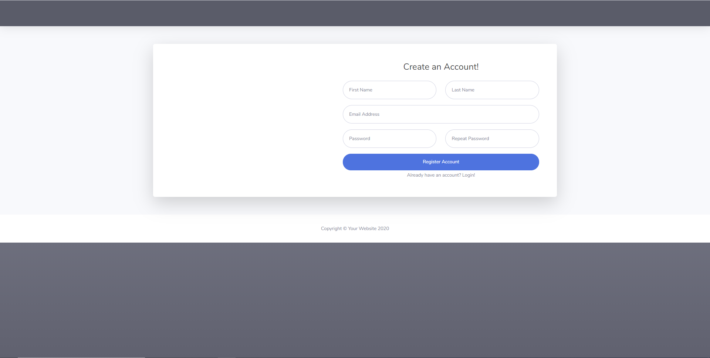

# BeetleScope

## Description:

This is a fullstack web application that allows users to signup and create a project and tasks for that project. It is designed to help users organize and collaborate with others to create a workspace anyone can use.

### Link to deployed app
https://beetlescope.herokuapp.com/

## Packages/Dependencies

-Express
-Handlebars
-mysql
-mysql2
-sequelize
-connect-session-sequelize
-express-handlebars
-express-session
-express-session-sequelize
-dotenv
-bcrypt
-nodemon
