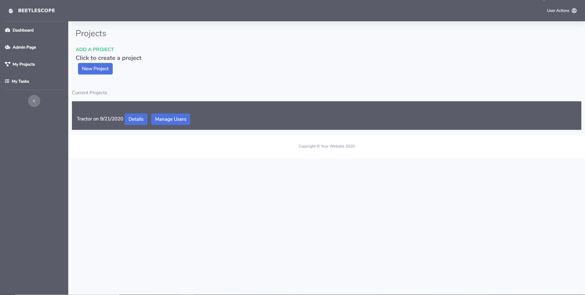

# BeetleScope

## Operation:

### Heroku
https://beetlescope.herokuapp.com/

### Github
https://github.com/barmstrong1188/beetlescope

This is a fullstack web application that allows users to signup and create a project and tasks for that project. It is designed to help users organize and collaborate with others to create a workspace anyone can use.

## Project Requirements
Your project should fulfill the following requirements:

Use Node.js and Express.js to create a RESTful API.

Use Handlebars.js as the templating engine.

Use MySQL and the Sequelize ORM for the database.

Have both GET and POST routes for retrieving and adding new data.

Be deployed using Heroku (with data).

Use at least one new library, package, or technology that we haven’t discussed.

Have a polished UI.

Be responsive.

Be interactive (i.e., accept and respond to user input).

Have a folder structure that meets the MVC paradigm.

Include authentication (express-session and cookies).

Protect API keys and sensitive information with environment variables.

Have a clean repository that meets quality coding standards (file structure, naming conventions, best practices for class/id naming conventions, indentation, quality comments, etc.).

Have a quality README (with unique name, description, technologies used, screenshot, and link to deployed application).