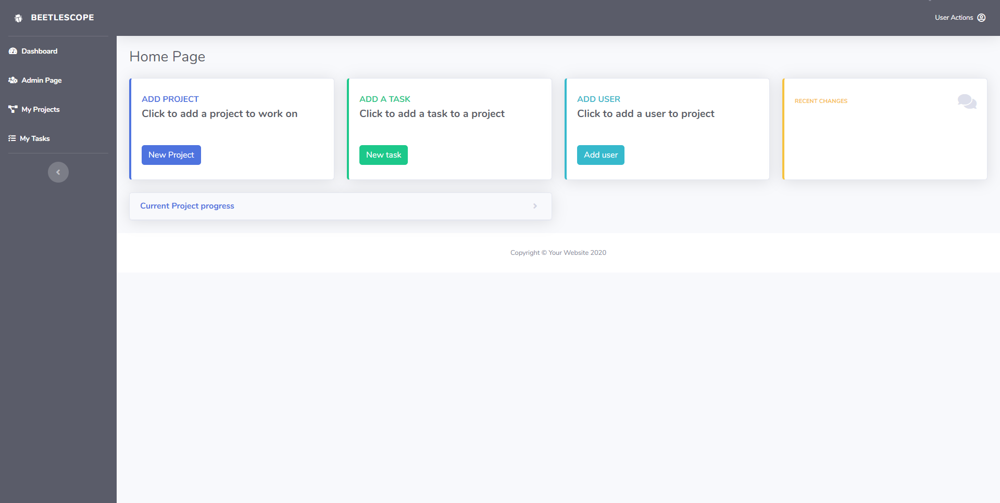
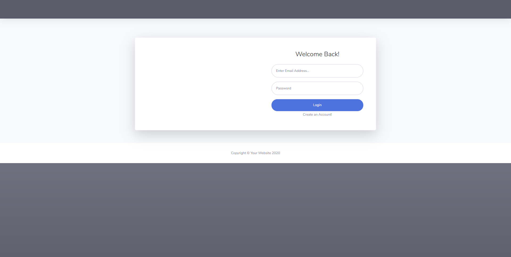

# BeetleScope

## Description:

This is a fullstack web application that allows users to signup and create a project and tasks for that project. It is designed to help users organize and collaborate with others to create a workspace anyone can use.

### Link to deployed app
https://beetlescope.herokuapp.com/

## Packages/Dependencies

-Express  
-Handlebars  
-mysql  
-mysql2  
-sequelize  
-connect-session-sequelize  
-express-handlebars  
-express-session  
-express-session-sequelize  
-dotenv   
-bcrypt  
-nodemon  
